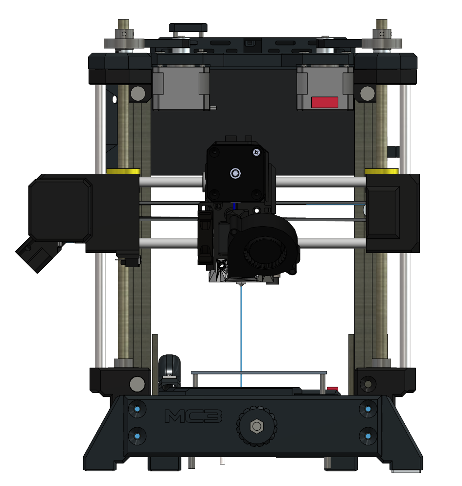

# miniprusa MC3 
## FDM/FFF 3D printer project

Heavy Duty, small factor, cartesian (bedslinger) machine capable of printing high detail plastic prints (PLA, PETG, TPU and possibly ABS, ASA, other high-temp materials). Project is loosely based on Bearmod project for Prusa i3. Utilizes out-of-the-shelf components and 3d prints.

Fusion360 model: https://a360.co/3Ne5RhL

## Features

- ~100x100x110 [mm] build volume
- Direct MK3s extruder [remixed] for MK8/HobbGoblin drive gear and filament sensor (switch)
- Popular [Bearmod] XZ axis design, inverted
- LM8UU and 8mm smooth rods linear guide
- Rigid metal frame out of steel plates, 2040 and 2060 aluminum profiles
- Dual Z axis is driven independent with 1:2 gear ratio with nema 17 motor for each side
- [Marlin] 2.0.9.1 with auto bed leveling
- Custom ergonomic controller with OLED and encoder

## Technical details

### Frame
Frame consists of 2040 and 2060 aluminum extrusion profiles with 6mm groove. Steel plates and 3 printed bars (front, back and top) are holding extrusions in place secured with M5 screws and t-nuts.

### XYZ drive
Nema 17 stepper drivers for all axes. GT2 belt and pulleys. Dual Z axis consist of two trapezoidal screws with 8mm pitch (TR8x2) driven by independent motors with 1:2 gear ratio (GT2 T20 and GT2 T40).

### Extruder
Extruder is simplified PRUSA MK3 extruder with HobbGoblin/MK8 drive gear and 624ZZ idler bearing (PRUSA MK2s style).

Very consistent extrusion ;) 

### Electronics
Currently project uses RAMPS (https://reprap.org/wiki/RAMPS_1.4), as it is the most common mainboard.

Link to: [OLED Controller with encoder] project.

Power supply should be at least 200W
PSU is not mounted on the frame as printer was supposed to be in enclosure.

### Additions
Two types of cable tubing hoses 10mm (X,Y axes and OLED controller) and 16/17mm (extruder)

## BOM
The design require printed parts, so owning, renting 3d printer or outsourcing is needed.
Material PETG (open) or ABS, ASA (especially, if enclosing) are recommended.

Full [BOM spreadsheet] file.

Summary:

## Firmware changes

Marlin 2.0.9.1 (v1.1) binary included - compiled for Ramps 1.4 and [miniOLED].

## Development

Want to contribute? Great!

To do:
> - revise Y axis
  - change endstop position
  - redesign bed plate
  - consider 
- redesign Z axis (one motor & synchronous belt drive)
> - BOM (translate, ensure correct number of screws and bolts, update links, double-check content)
 
Feel free to leave additional feedback.

[Forum thread] in Polish

## License

GPLv3

**Open Source, Hell Yeah!**

[//]: # (REFLINKS)
   [bearmod]: <https://www.thingiverse.com/thing:4362586>
   [remixed]: <https://www.thingiverse.com/thing:4566108>
   [Marlin]: <https://marlinfw.org/>
   [BOM spreadsheet]: <https://github.com/jgxftw/miniprusa/BOM/>
   [Reprap Forum thread]:<https://reprap.org/forum/read.php?13,499572,page=1>
   [Forum thread]: <https://reprapy.pl/viewtopic.php?f=78&t=7788&hilit=ma%C5%82a+czarna#p127598>
   [OLED Controller with encoder]: <https://github.com/jgxftw/minioled>
   [miniOLED]: <https://github.com/jgxftw/minioled>
